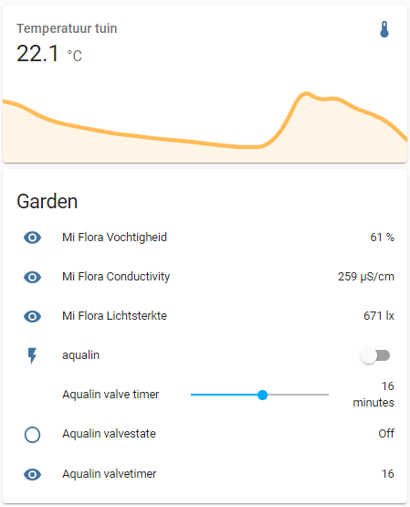
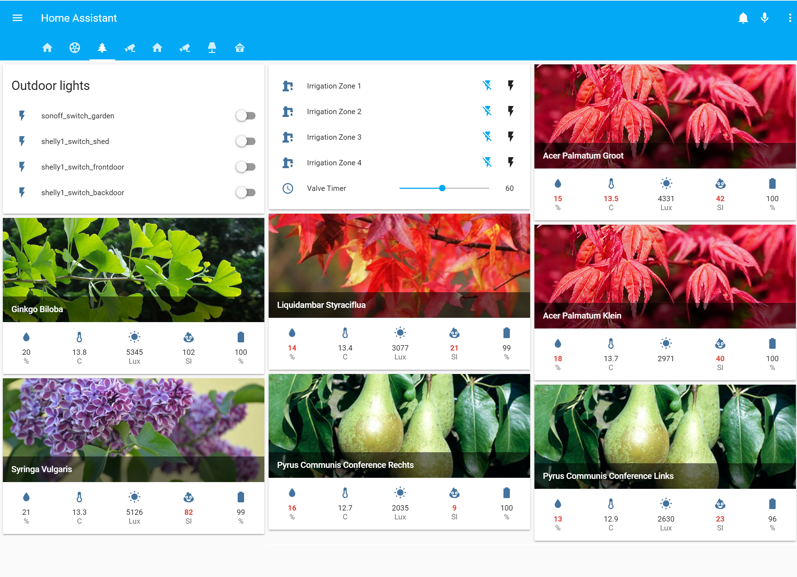

# garden-mqtt-deamon rev. 0.3

Description: Lightweight BLE mqtt deamon controller for Aqualin valves and Xiaomi Vetrug Mi Flora Plant sensors with a Rasberry Pi

All rights of the device are owned by Aqualin and Xiaomi

This tool monitors both Aqualin valves and MiFlora sensors and allows you to control the Aqualin valves. The tool uses MQTT to send and receive data, so you can use it with your favorite home automation system. An example for Home Assistant is provided. 

This tool is originally developed by RoyOltmans (https://github.com/RoyOltmans/garden-mqtt-deamon), but has been modified significantly. Main improvements are
- Code rewritten from Python 2 to Python 3
- Simplyfied mqtt message structure to make a clear distinction between switching commands and status commands.
- Better error handling (prevents hanging when not able to connect to valve and/or mqtt server)
- Added option to use username/password for mqtt server
- Added a different scan interval when the valve is "on", to be able to see the timer counting down. 
- Updated the documentation, including Home Assistant configuration

Many thanks to:
RoyOltmans for building the initial version of garden-mqtt-deamon (https://github.com/RoyOltmans/garden-mqtt-deamon), I reused a major part of his code. 
Kipe for building miplant https://github.com/kipe/miplant, RoyOltmans reused his project and combined it with his aqaulin project.

**Usage of this project is on your own risk.**

# Installation
This project has been build on linux raspbian on a Raspberry Pi 3B, but will most likely also run on other devices. 

1) Upgrade and update all repositories:

```
    $  sudo apt-get update
       sudo apt-get upgrade
       sudo apt-get dist-upgrade
```

2) Firstly install necessary utils

Install the required tools and libraries to support BLE:
```
    $  sudo apt-get install git bluetooth bluez
       sudo apt-get install python3
       sudo apt-get install python3-pip
``` 

3) A MQTT broker is required. Install a MQTT broker (for example mosquitto) 
```
    $  sudo apt-get install mosquitto mosquitto-clients
```

Detailed description can be [found here](https://learn.adafruit.com/diy-esp8266-home-security-with-lua-and-mqtt/configuring-mqtt-on-the-raspberry-pi): 

4) Install necessary python packages for the project
```
    $  sudo pip3 install paho-mqtt
       sudo pip3 install schedule
```

5) Install miflora requirements
For details see https://github.com/kipe/miplant
```
    sudo apt-get install libglib2.0-dev
    sudo pip3 install bluepy
```

6) Install garden mqtt deamon
```
    $  sudo git clone https://github.com/Ernst79/garden-mqtt-deamon.git /opt/garden-mqtt-deamon
```

7) We will need the MAC address(es) of the valves, you can identify these by the following command:
```
    $  sudo hcitool lescan
``` 
write down the mac address of the valve(s) eg 01:02:03:04:05:06. You need the ones with Spray-Mist. 

A example line would be
```
01:02:03:04:09:B6 Spray-Mist 09B6
```

Afterwards try connecting by using the following command:

```
gatttool -I
[                 ][LE]> connect 01:02:03:04:09:B6
```

Afterwards you get into a prompt, execute the following command:

```
[01:02:03:04:09:B6][LE]> char-desc
```

This should give a long list of ID's, if this works it should be "ok". type 'exit' to quit gattool. 

8) Configure the config.ini

Edit the config.ini via your favorite text editor (e.g. nano, vi etc). Change the mac address if you have one valve remove the whole line of mac addresses and the ','. Also change the MQTThost to the IP address or DNS name of the host running the MQTT server and change the port, username and password.

```
sudo nano /opt/garden-mqtt-deamon/config.ini
```

You can also set the scan intervals of the valve and the miflora sensors. For the valve, a different interval can be used during "on" and "off". This allows you to see the timer in e.g. Home Assistant counting down every minute, while it will safe battery by only checking the state every 5 minutes when it is off. You can set these times to whatever you like. 

# Usage

Set execution for the script

```
    $  sudo chmod +x /opt/garden-mqtt-deamon/garden-mqtt-deamon.py
```

Execute the script to test if it works (You can exit the Python script by pressing ctrl+c).
```
    $  cd /opt/garden-mqtt-deamon
       python3 garden-mqtt-deamon.py
```

Start a new bash instance and follow MQTT publications, use the following command below to follow the MQTT output
```
    $  mosquitto_sub -h [MQTT Host] -t '#' -v
```

To switch an aqualin valve on, fill in the correct mac address (scanned with hcitool) with the following MQTT message (-m is the payload how long the valve will be opened (in minutes) before it closes again). 
```
    $  mosquitto_pub -h [MQTT Host] -t home/aqualin/[Aquilin BLE MAC]/switch -m [payload, timer in minutes]
```

The aqualin valve will automatically stop after the set time. If you want to stop earlier, you can send the same message with a payload of 0 minutes. 
```
mosquitto_pub -h [MQTT Host] -t home/aqualin/[Aquilin BLE MAC]/switch -m 0
```

The status of the valves and MiFlora sensors is checked at the intervals set in the 'config.ini' file and for the Aqualin valves, also right after a switch command (to verify that is has been set correctly). The response of the valves will be send via the following MQTT path with the Message payload below:
```
    home/aqualin/[Aquilin BLE MAC]/valvestate [on/off]
    home/aqualin/[Aquilin BLE MAC]/valvetimer [timer duration]

    home/miflora/[MiFlora BLE MAC]/Temperature [temperature in °C]
    home/miflora/[MiFlora BLE MAC]/Moisture [Moisture in %]
    home/miflora/[MiFlora BLE MAC]/Conductivity [Conductivity in µS/cm]
    home/miflora/[MiFlora BLE MAC]/Light [Light in lx]
```

Make a note of the MiFlora mac address, e.g. if you want to integrate these sensors in Home Assistant (see below). 

# Automatic startup garden-mqtt-deamon with systemd
If all runs fine, you can choose to make the garden-mqtt-deamon tool to run automatically, also after a restart, with systemd. First, create a service file.
```
sudo nano /etc/systemd/system/garden-mqtt-deamon.service
```

Add the following content to the file

```
[Unit]
Description=Aqualin MQTT service
After=network.target

[Service]
ExecStart=/usr/bin/python3 -u garden-mqtt-deamon.py
WorkingDirectory=/opt/garden-mqtt-deamon
StandardOutput=inherit
StandardError=inherit
Restart=always
User=root

[Install]
WantedBy=multi-user.target
```

Now reload systemd configuration and start the the service
```
sudo systemctl daemon-reload 
sudo systemctl start garden-mqtt-deamon.service
```

You can check the status with 
```
sudo systemctl status garden-mqtt-deamon.service
```

You can stop the service with 
```
sudo systemctl stop garden-mqtt-deamon.service
```

# Home Assistant example overview
To integrate the different switches and sensors in Home Assistant, you can use the following yaml configuration. Please note that a template switch is used in stead of a MQTT switch, due to the fact that you cannot send variable integers based on a template value with a MQTT switch in Home Assistant. We need this to set the timer, so we have to use the template switch in this case. input_number is used to set the timer. 

Make sure you change the mac address of the Aqualin valve (in the example 01:02:03:04:05:06) and the MiFlora sensor (in the example c4:7c:8d:6b:4f:f3) to your own mac adressess. 

```
# Aqualin Valve switch
switch:
  - platform: template
    switches:
      aqualin:
        value_template: '{{ is_state("binary_sensor.aqualin_valvestate", "on") }}'
        turn_on:
          - service: mqtt.publish
            data_template:
              topic: 'home/aqualin/01:02:03:04:05:06/switch'
              payload: "{{ states('input_number.aqualin_timer') | int }}"
        turn_off:
          - service: mqtt.publish
            data_template:
              topic: 'home/aqualin/01:02:03:04:05:06/switch'
              payload: "0"

# Aqualin Valve timer input
input_number:
  aqualin_timer:
    name: Aqualin valve timer
    min: 1
    max: 30
    step: 1
    unit_of_measurement: minutes
    icon: mdi:mdi-alarm

# Aqualin binary sensor (on/off)
binary_sensor:
  - platform: mqtt
    name: Aqualin valvestate
    state_topic: "home/aqualin/01:02:03:04:05:06/valvestate"
    payload_on: "on"
    payload_off: "off"

# Aqualin sensors
sensor:
  - platform: mqtt
    name: Aqualin valvetimer
    state_topic: "home/aqualin/01:02:03:04:05:06/valvetimer"

# Mi Flora sensors
  - platform: mqtt
    name: Mi Flora Temperature
    state_topic: "home/miflora/c4:7c:8d:6b:4f:f3/Temperature"
    unit_of_measurement: '°C'
  - platform: mqtt
    name: Mi Flora Moisture
    state_topic: "home/miflora/c4:7c:8d:6b:4f:f3/Moisture"
    unit_of_measurement: '%'
  - platform: mqtt
    name: Mi Flora Conductivity
    state_topic: "home/miflora/c4:7c:8d:6b:4f:f3/Conductivity"
    unit_of_measurement: 'µS/cm'
  - platform: mqtt
    name: Mi Flora Light
    state_topic: "home/miflora/c4:7c:8d:6b:4f:f3/Light"
    unit_of_measurement: 'lx'
  - platform: mqtt
    name: Mi Flora Battery
    state_topic: "home/miflora/c4:7c:8d:6b:4f:f3/Battery"
    unit_of_measurement: '%'
  - platform: mqtt
    name: Mi Flora Firmware version
    state_topic: "home/miflora/c4:7c:8d:6b:4f:f3/Firmware"
```




